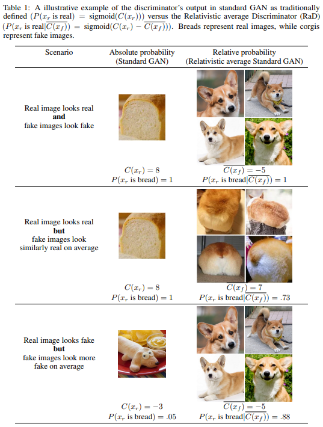

# RelativisticGAN-Tensorflow
Simple Tensorflow implementation of [RelativisticGAN](https://arxiv.org/pdf/1807.00734.pdf)

## Summary
### Idea

### Formulation
*Name* | *Formulation*
:---: | :---: |
**GAN**| 
　
**RGAN**| 
　
**RaGAN**| 
　
**RaGAN-GP**| 
　
**RaLSGAN**| 
　
**RaHingeGAN**| 

## Results

## Author
Junho Kim
