# RelativisticGAN-Tensorflow
Simple Tensorflow implementation of [RelativisticGAN](https://arxiv.org/pdf/1807.00734.pdf)

## Issue
* For 256x256, the network does not generate the image properly. (DCGAN Architecture)
* I think, `RaDRAGAN` more better than `RaLSGAN`

## Usage
### dataset

```python
> python download.py celebA
```

* `mnist` and `cifar10` are used inside keras
* For `your dataset`, put images like this:

```
├── dataset
   └── YOUR_DATASET_NAME
       ├── xxx.jpg (name, format doesn't matter)
       ├── yyy.png
       └── ...
```

### train
* python main.py --phase train --dataset celebA --Ra True --gan_type dragan

### test
* python main.py --phase test --dataset celebA --Ra True --gan_type dragan

## Summary
***"the discriminator estimates the probability that the given real data is more realistic than a randomly sampled fake data"*** 

*= RGAN*

***"the discriminator estimates the probability that the given real data is more realistic than fake data, on average"*** 

*= RaGAN*
### Idea
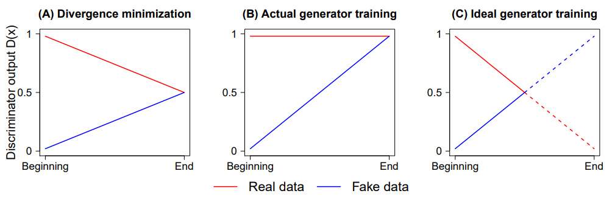

### Formulation
*Name* | *Formulation*
:---: | :---: |
**GAN**| 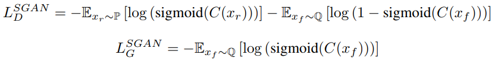
　
**RGAN**| 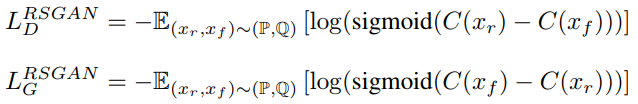
　
**RaGAN**| 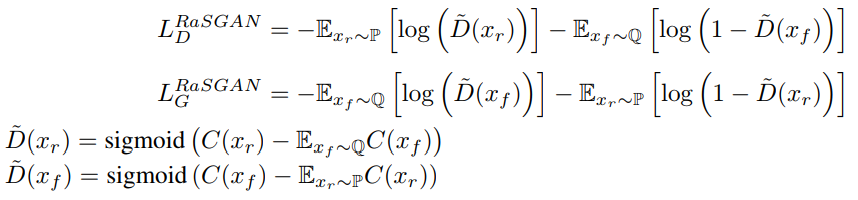
　
**RaGAN-GP**| 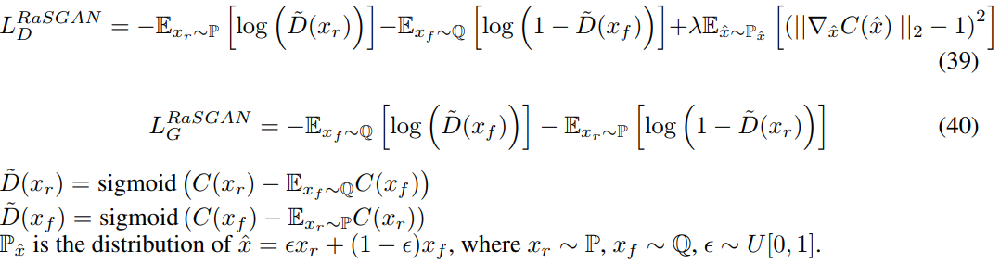
　
**RaLSGAN**| 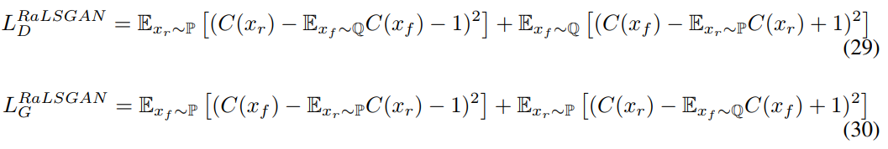
　
**RaHingeGAN**| 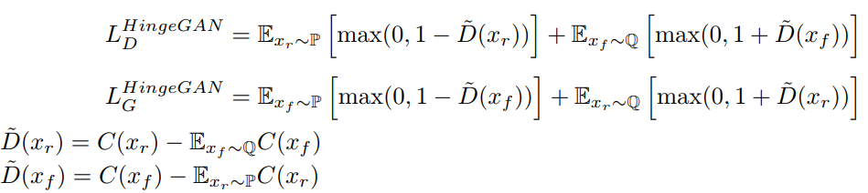

## Results
* 128x128 celebA
* 200k iterations (but, 100k iteration is also enough)
* **RaDRAGAN** is not in the paper, I just tried because I wanted to do it.

*Name* | *Original* | *Original + Ra* |
:---: | :---: | :---: |
**GAN** | 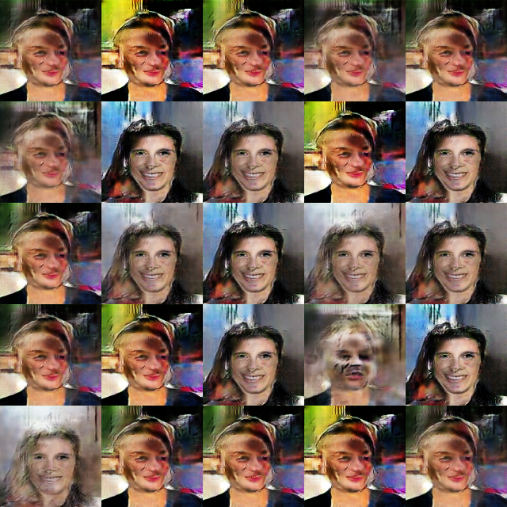 | 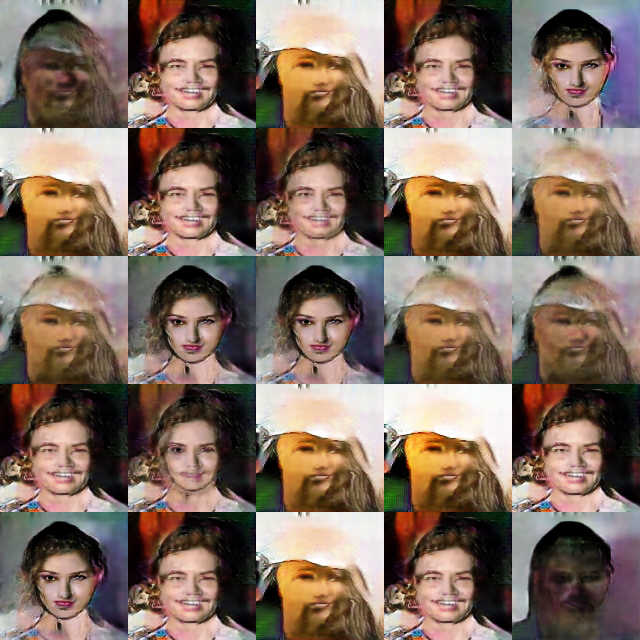 |
　
**LSGAN** | 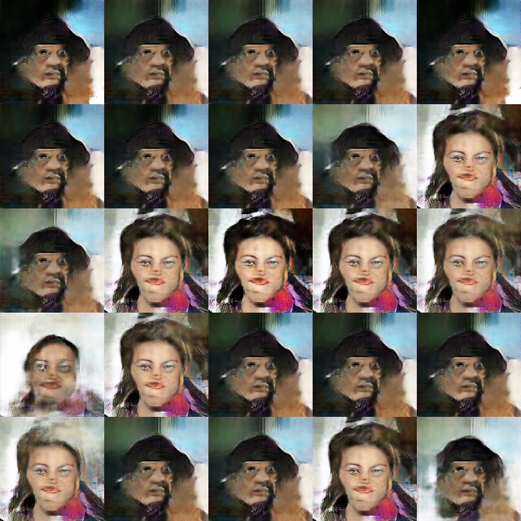 | 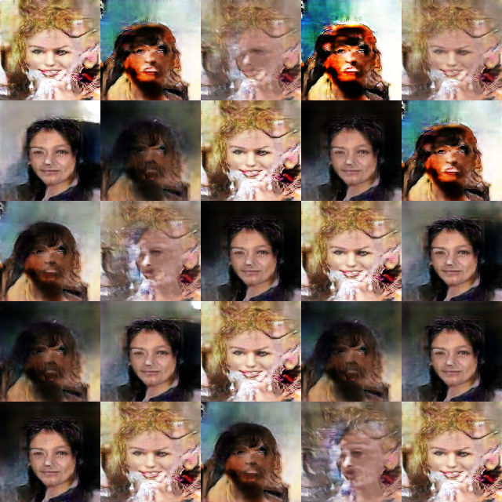 |
　
**DRAGAN** | 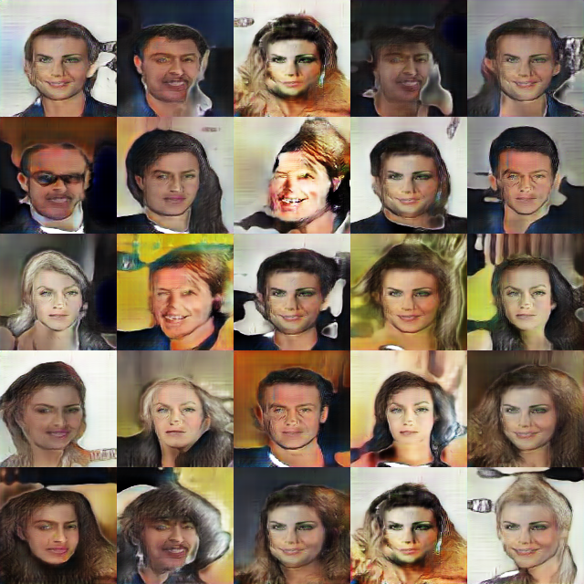 | 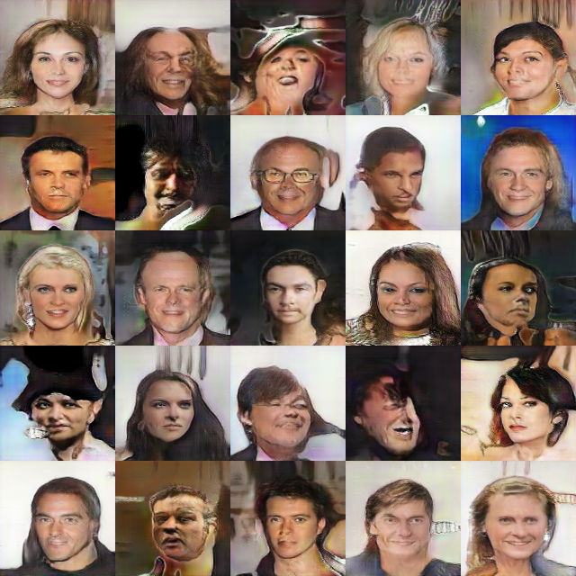 |

## Error
### Original DRAGAN
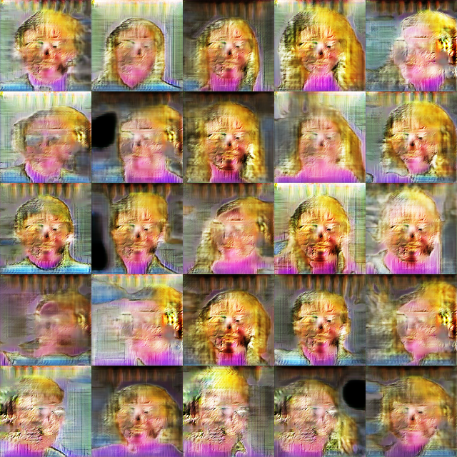
* In the case of `DRAGAN`, the images are sometimes distorted during the training

## Author
Junho Kim
